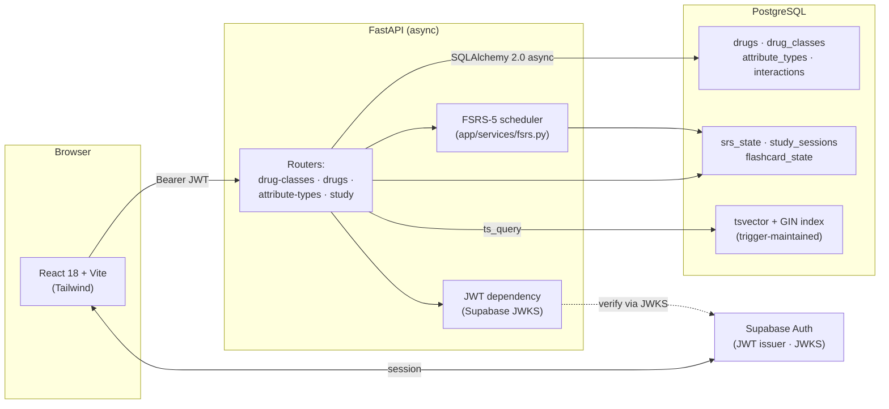

# Pharmacy Study App

A spaced-repetition study tool for pharmacy students. Drugs are modeled as
structured entities (mechanism, indications, ADRs, metabolism, interactions),
and the app surfaces those attributes as either flashcards scheduled by FSRS-5
or as N×M comparison tables.

> **Status:** in active development. Backend, frontend, and auth are wired
> end-to-end; demo deployment and expanded drug catalog are next. See
> [`docs/plan.md`](docs/plan.md) for the current roadmap.

## What's interesting about this codebase

- **FSRS-5 implemented from scratch** in pure Python ([`app/services/fsrs.py`](app/services/fsrs.py))
  with 30 unit tests. No black-box SRS library.
- **Two study modes share one data model.** Flashcards track per-(user, drug)
  SRS state; table mode reads the same attributes as a comparison grid.
- **Hybrid relational + JSONB schema.** Common attributes live in typed
  columns; per-drug-class irregular fields live in a `JSONB` escape hatch.
  Rationale in [`docs/schema.md`](docs/schema.md).
- **Postgres `tsvector` full-text search** maintained by a DB trigger — no
  application-layer search index, no Elasticsearch.
- **Self-referential drug-class hierarchy** queried via recursive CTEs, so
  "all drugs under β-lactams" works without app-side tree walking.
- **Canonical-ordered interactions** (`drug_a_id < drug_b_id`) — one row
  per drug pair, queries account for both directions.
- **Async end-to-end:** SQLAlchemy 2.0 async sessions, async Alembic env,
  `asyncpg` driver.
- **Supabase JWT auth via JWKS** with an async-safe cached fetcher
  ([`app/dependencies/auth.py`](app/dependencies/auth.py)) — no custom auth code.

## Architecture



### Request flow — submitting a flashcard rating

1. User clicks **Good** on a revealed card in `FlashcardView`.
2. Frontend `POST /study/review` with `{drug_id, attribute_type_id, rating}` and
   `Authorization: Bearer <supabase_jwt>`.
3. FastAPI `get_current_user` dependency decodes the JWT against Supabase's
   JWKS (cached, async-safe) and extracts the `sub` claim as `user_id`.
4. Router loads the current `SrsState` row for `(user_id, drug_id)`.
5. `fsrs.schedule()` computes new `stability`, `difficulty`, `state`,
   `due_date` from the rating.
6. Row is upserted; a `study_sessions` review entry is appended.
7. Response returns the new `due_date` and `stability` — the UI briefly shows
   "Next review in N days" before advancing.

## Stack

| Layer       | Tech                                                    |
| ----------- | ------------------------------------------------------- |
| Frontend    | React 18, TypeScript, Vite, Tailwind CSS                |
| Backend     | FastAPI, Python 3.12, SQLAlchemy 2.0 (async), Alembic   |
| Database    | PostgreSQL (Supabase-hosted), `tsvector` FTS, JSONB     |
| Auth        | Supabase Auth (JWT via JWKS)                            |
| SRS         | FSRS-5, implemented in-repo                             |
| Tests       | pytest (70+ tests, unit + smoke)                        |

## Local setup

Requires Python 3.12+, Node 20+, and Docker (for the local Postgres).

```bash
# 1. Start Postgres
docker compose up -d

# 2. Backend
python -m venv .venv && .venv\Scripts\activate     # Windows
# source .venv/bin/activate                        # macOS/Linux
pip install -e ".[dev]"
cp .env.example .env                               # then fill in DATABASE_URL
alembic upgrade head
uvicorn app.main:app --reload                      # http://localhost:8000

# 3. Frontend (new terminal)
cd frontend
npm install
cp .env.example .env                               # VITE_USE_MOCK=true works without a backend
npm run dev                                        # http://localhost:5173

# 4. Tests
pytest                                             # backend
cd frontend && npm run build                       # type-check + production build
```

**Mock mode.** Setting `VITE_USE_MOCK=true` in `frontend/.env` swaps the entire
API layer for static data — the app runs end-to-end with no backend or DB.
Useful for UI work and the demo path.

## Project structure

```
app/                  FastAPI backend
  models/             SQLAlchemy 2.0 ORM models
  routers/            HTTP endpoints
  schemas/            Pydantic request/response shapes
  services/fsrs.py    Pure FSRS-5 scheduler
  dependencies/auth.py  Supabase JWT verification
frontend/src/         React + TypeScript SPA
  api/                Real client / mock / switching layer
  components/         UI components (browser, selector, table, flashcard)
docs/
  schema.md           DB design rationale — read before schema changes
  decisions.md        Architectural decisions: what, why, what we passed on
  plan.md             Active roadmap
  db/migrations/      Raw SQL migrations (source of truth for schema)
alembic/              Async Alembic env + generated revisions
tests/                pytest suites (unit + smoke)
```

## Roadmap highlights

See [`docs/plan.md`](docs/plan.md) for the full task list. Next up:

- Live demo deployment (TBD between Azure / Fly.io / Render)
- Expanded seeded drug catalog (~50 real drugs) so the app feels alive on
  first launch
- `/drugs/search` endpoint backed by the existing `tsvector` index
- Per-user FSRS weights with a configuration endpoint

## License

Not yet specified.
