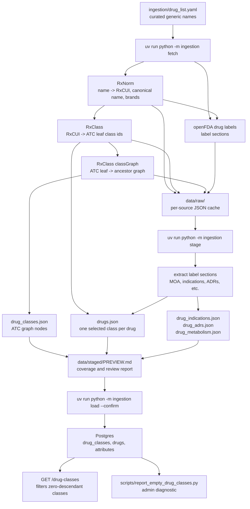

# Ingestion Pipeline

The ingestion pipeline is catalog-seeded: it starts from a curated list of
generic drug names, then enriches those names with external source data. It does
not currently start from a drug-class taxonomy and discover every member drug in
each class.

## Current Flow



## Why Generic Names Drive Ingestion

`ingestion/drug_list.yaml` is the root input. Each entry is a name the project
has decided is worth trying to ingest. The fetch step resolves those names
through RxNorm, then uses the resulting RxCUIs to fetch class and label data.

This is why adding more drugs currently means adding more generic names. The
pipeline can enrich a requested drug, but it does not yet ask RxClass, ATC, or
another source for "the next drugs we should add."

## Why Empty Classes Can Exist

It seems contradictory that classes are discovered from drugs but can still be
empty. The reason is that the pipeline stores a broader source taxonomy than the
single class assignment stored on each drug.

The current behavior has three important details:

1. RxClass can return multiple ATC leaf class ids for one RxCUI.
2. The stage step fetches and stores the ATC class graph for those leaf ids.
3. The normalized `drugs` row chooses one class slug with
   `pick_leaf_slug()`, selecting the deepest class id with a deterministic
   tie-break.

That means a class can enter `drug_classes` because it appeared in source
classification data, while no drug ends up assigned to that exact branch after
normalization. Those classes are useful as an admin/data-quality signal, but not
as learner-facing study choices.

The API handles this by filtering `/drug-classes` to only return nodes with a
positive descendant drug count. Parent classes with zero direct drugs are still
returned when at least one descendant has drugs, because direct assignment is not
the meaningful learning unit in this hierarchy.

To audit hidden branches against the current database:

```powershell
uv run python scripts/report_empty_drug_classes.py
```

To write a Markdown report:

```powershell
uv run python scripts/report_empty_drug_classes.py --output empty-drug-classes.md
```

## Expansion Designs

### Option A: Curated Name List Expansion

Keep the current architecture. Add more generic names to
`ingestion/drug_list.yaml`, run fetch, stage, review `PREVIEW.md`, then load.

This is the safest path because it preserves human control over what enters the
study catalog. It also fits the app's learning goal: the catalog should contain
drugs a pharmacy student actually intends to study, not every possible class
member an external taxonomy can enumerate.

Tradeoff: expansion is manual and the taxonomy will remain incomplete.

### Option B: Ranked Common-Drug Candidate Import

Use a public ranked source, such as ClinCalc DrugStats or AHRQ MEPS prescribed
medicines data, to produce candidate generic names. A maintainer still reviews
the candidates before they are added to `drug_list.yaml`.

This keeps the current ingestion pipeline, but makes candidate generation less
ad hoc.

Tradeoff: public ranking data often includes brands, combinations, salts,
insulins, devices, and non-drug entries that need normalization and curation.

Near-term source choice: use ClinCalc DrugStats Top 300 as the candidate list
for the next expansion pass because it is already presented as a ranked,
human-readable drug list. Keep AHRQ MEPS prescribed medicines data as a later
expansion source if we want a more official/public-data pipeline, accepting that
it will require more processing before it becomes usable candidate names.

### Option C: Empty-Class Backfill Candidates

Use the empty-class report to choose important empty branches, then manually add
representative drugs for those branches.

This improves class coverage where the current UI/reporting shows gaps.

Tradeoff: "class coverage" and "common in practice" are not the same goal. This
can over-prioritize rare drugs just because they fill taxonomy holes.

### Option D: Taxonomy-Driven Discovery

Add a new discovery step that asks a source for member drugs of selected classes,
then turns those members into candidate names for review.

This is a larger design change. The pipeline would no longer be purely
catalog-seeded; it would become partly taxonomy-driven.

Tradeoff: more automation, but also more normalization work, more false
positives, and a clearer need for candidate review tooling.

## Recommended Near-Term Approach

Use Option A plus a small piece of Option B:

1. Pick the next target size, for example "add 50 more common generics."
2. Generate candidates from ClinCalc DrugStats Top 300.
3. Normalize names into the project's `drug_list.yaml` style.
4. Review the additions manually.
5. Run:

   ```powershell
   uv run python -m ingestion fetch
   uv run python -m ingestion stage
   ```

6. Review `data/staged/PREVIEW.md`.
7. Run the empty-class report.
8. Load only after the staged data looks useful.

This keeps the current pipeline understandable while making expansion less
hand-built.

## Idempotency

The pipeline is designed to tolerate repeated runs, but the idempotency key is
not equally strong at every layer.

Fetch idempotency:

- Raw RxNorm cache files are keyed by normalized query name.
- Raw RxClass files are keyed by RxCUI and class id.
- Raw openFDA files are keyed by RxCUI when available, otherwise normalized
  query name.
- Re-running `fetch` without `--refresh` reuses those cache files.
- Re-running `fetch --refresh` re-requests source data and overwrites the raw
  cache.

Load idempotency:

- `attribute_types` are upserted by `slug`.
- `drug_classes` are upserted by `slug`.
- `drugs` are selected by current display `name`; existing rows are updated,
  missing rows are inserted.
- List-shaped rows for staged drugs are delete-then-insert for each drug, so
  indications, ADRs, and metabolism rows should not accumulate duplicates for
  drugs included in the staged set.

Known weak point:

`drugs` does not currently have a stable `slug` or external source identifier
with a unique constraint. If the same real-world drug is staged later under a
different normalized display name, the loader may insert a second row instead
of updating the first. The current workflow reduces this risk by keeping
`drug_list.yaml` curated and stable, but it is not as robust as a true
`drugs.slug` or `drugs.rxcui` uniqueness decision.

Operationally, repeated runs with the same `drug_list.yaml` should be resilient:
they update existing rows rather than duplicating them. Expansion batches still
need review because name normalization and combination products can change the
effective identity of a drug.
